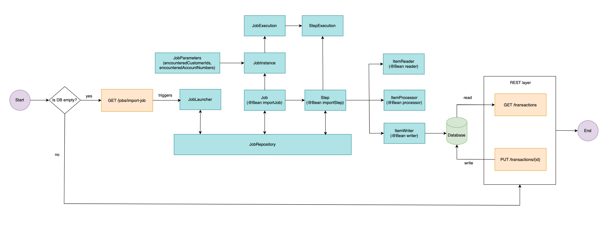
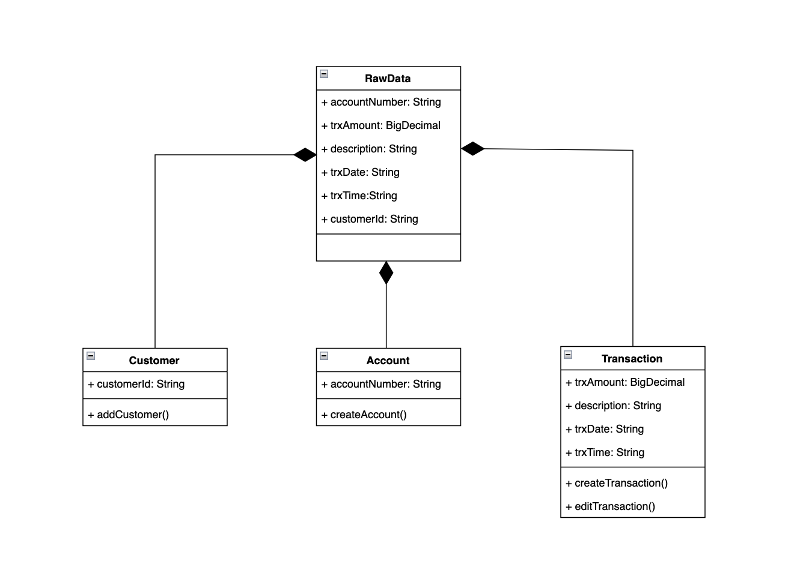
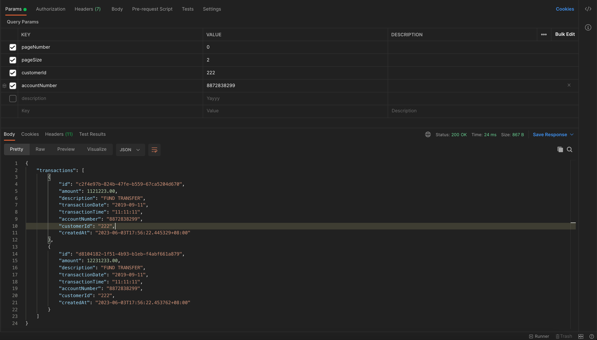

# Spring Batch Text File Processing with RESTful API

This repository demonstrates a Spring Batch application that processes a text file using Spring Batch framework. The application is designed to read the text file (`dataSource.txt`) from the resources folder, perform batch processing operations on the data, and provides a RESTful API to retrieve and update records in the database.

## Prerequisites

Before running the application, ensure that you have the following prerequisites:

- Java Development Kit (JDK) 17 installed
- Apache Maven installed
- IDE (such as IntelliJ IDEA or Eclipse) for code editing (optional)

## Getting Started

To get started with the application, follow these steps:

1. Clone the repository:
   ```bash
   git clone <repository_url>
2. Build the project using Maven:
   ```bash
   mvn clean install
3. Export the environment variables:
   ```bash
   export DATASOURCE_URL=<datasource_url>
   export DATASOURCE_SECRET=<datasource_secret>
   export API_TOKEN=<api_token>
4. Run the application:
   ```bash
   mvn spring-boot:run

## Batch Configuration

The batch processing logic is defined in `BatchConfig.java`. The main components involved in the batch processing are:

- ItemReader: Reads data from the input file.
- ItemProcessor: Processes the input data and performs business logic.
- ItemWriter: Writes the processed data to the database.

## Input Data

The input data for the batch job is a text file located in the src/main/resources directory. By default, the application is configured to read from the file named `dataSource.txt`. You can replace this file with your own text file, or modify the configuration to read from a different file.

## RESTful API

The application also provides a RESTful API to retrieve and update records in the database. The API endpoints and their functionalities are as follows:

1. `GET /jobs/import-job` (authentication required): Triggers the batch job to process the input file `dataSource.txt`
2. `GET /transactions`: Retrieves transactions based on the provided query parameters.
   - Query Parameters:
     - pageNumber: The page number of the results (optional, default: 0).
     - pageSize: The number of transactions per page (optional, default: 10).
     - customerId: Filter transactions by customer ID (optional).
     - accountNumber: Filter transactions by account number (optional).
     - description: Filter transactions by description (optional).
3. `PUT /transactions/{id}` (authentication required): Updates an existing transaction in the database.

You can use tools like cURL or Postman to interact with the API endpoints and perform CRUD operations on the user records.

## Design Patterns

### CQRS (Command Query Responsibility Segregation)
This repository utilizes the CQRS (Command Query Responsibility Segregation) architectural pattern to manage the system's data and operations. The main idea behind CQRS is to optimize the system for different types of operations. By segregating the responsibilities, read operations can be optimized for fast and efficient data retrieval, while write operations can be optimized for consistency and transactional integrity. This separation allows each model to be independently scaled and optimized according to its specific requirements.

### Event Bus
In addition to utilizing the CQRS architectural pattern, this repository also incorporates an Event Bus as part of its implementation. Event Bus acts as a communication channel through which different parts of the system can publish and subscribe to events. When an event is published on the bus, any subscribed components that are interested in that event will receive it and can take appropriate actions. 


## Activity Diagram


## Class Diagram


## Entity Relationship (ER) Diagram


## Sample Results
### Database After Import
Customer Table


Account Table


Transaction Table


### API
`GET /transactions?pageNumber=0&pageSize=2&customerId=222&accountNumber=8872838299`


`PUT /transactions/c2f4e97b-824b-47fe-b559-67ca5204d670`


## Attachment Link
1. [Draw IO Diagram Link](https://app.diagrams.net/#G1zOytZ9Ej4Cs2XBXAJlzeJIDYyIHpYym-)